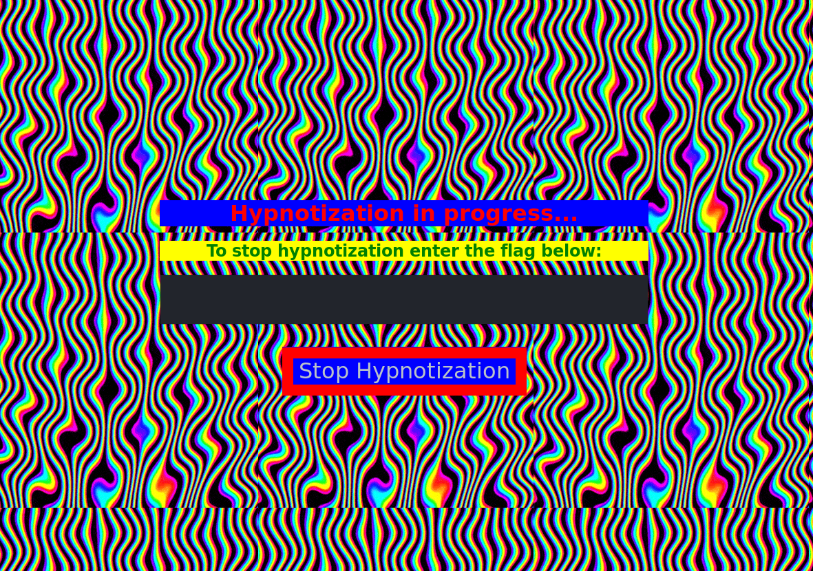
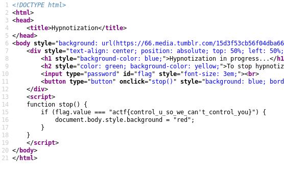

# Control You
## Web, 20 points

### Prompt

Only those who give us the flag are exempt from [our control](https://controlyou.2019.chall.actf.co/).

*Author: kmh11*

### Solution

After clicking on the link in the prompt, you are taken to a website that looks like this:

I'm not exactly the best at web problems, so whenever I encounter a problem, I head straight to Inspect Element or View Source. Luckily, that worked for this problem:

The flag is right in the source code: `actf{control_u_so_we_can't_control_you}`

*I just realized while writing this that the shortcut for View Source is `Control + U` and that's what the title was referencing...*
