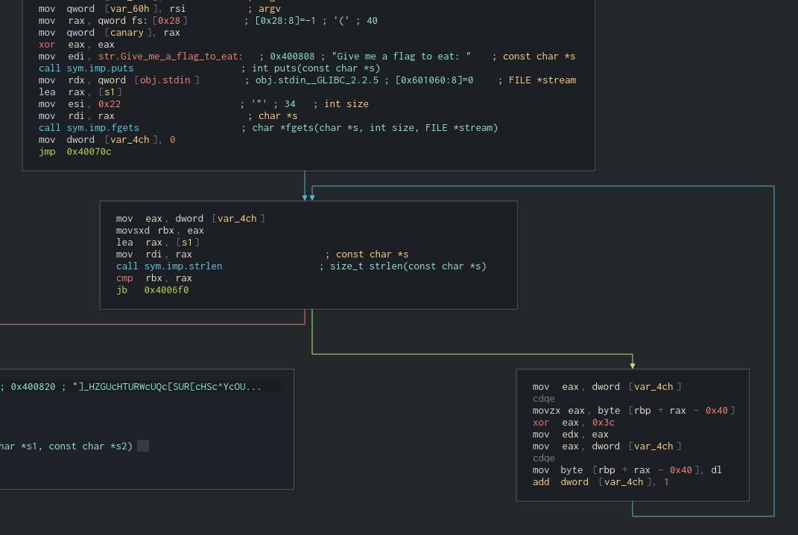
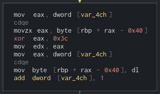

# One Bite
## Reversing, 60 points

### Prompt

Whenever I have friends over, I love to brag about things that I can eat in a single bite. Can you give this program a tasty flag that fits the bill?

`/problems/2019/one_bite`

*Author: SirIan*

### Solution

Open up the binary file we are provided with in Cutter and you will get this:



The program will take in a string, and then enters a for loop where it will XOR every bite with `0x3c`.



Once it's done it will compare the resulting string with `]_HZGUcHTURWcUQc[SUR[cHSc^YcOU_WA`.

So we need to find a string that, when every byte is XORed with `0x3c`, will give us `]_HZGUcHTURWcUQc[SUR[cHSc^YcOU_WA`. Whip up a little Python script:

```python
s = ']_HZGUcHTURWcUQc[SUR[cHSc^YcOU_WA'
a = ''

for letter in s:
    a += chr(ord(letter) ^ 0x3c)

print(a)
```

Run this program and you will get the flag: `actf{i_think_im_going_to_be_sick}`
