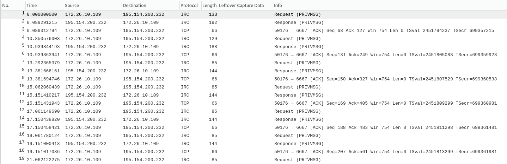
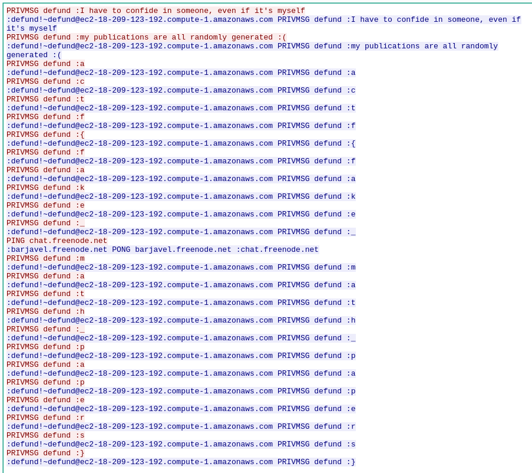

# Paper Trail
## Misc, 50 points

### Prompt

Something is suspicious about defund's math papers. See if you can find anything in the network packets we've intercepted from his computer.

*Author: defund*

### Solution

You are given a .pcapng file. Open it up in Wireshark and you are presented with this:

Looks like an IRC conversation over TCP. Luckily, there is a simple way in Wireshark to find out what they were sending.

Click `Analyze -> Follow -> TCP Stream` and you will see the contents of the TCP conversation:

As you can see, the flag was sent over IRC letter by letter. There's probably a better way to extract this, but I just copied the flag by hand to get: `actf{fake_math_papers}`.
