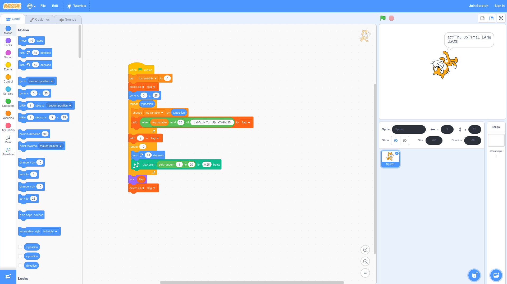

# Scratch It Out
## Misc, 60 points

### Prompt

An oddly yellow cat handed me this message - what could it mean?

*Author: innoviox*

### Solution

Based on the name of the challenge as well as the prompt, we can see that the file provided to us is the data for a Scratch program, a drag and drop programming language made for kids.

The JSON file can't be imported into the online Scratch editor directly, but Scratch will allow you to upload `.sb3` files. Run `cp project.json project.sb3` and upload the new `.sb3` file to the editor to get this program:

Run the program and the cat will tell you the flag: `actf{Th5_0pT1maL_LANgUaG3}`
