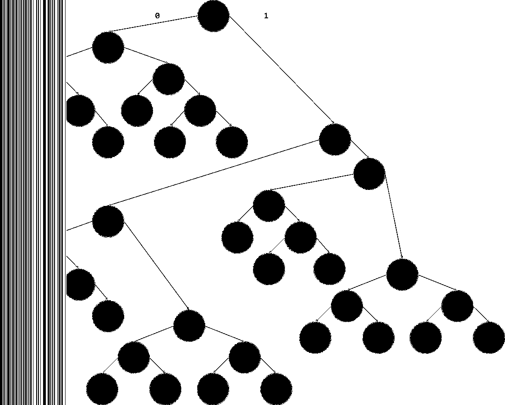

# Big Bad

100 points - 42 Solves

```
The Big Bad Wolf has entered the ring. He can HUFF, he can puff, but can he blow this house down?
```

## Solution:

Here is the original image.


Given the hint and the content of the file, we can deduce that this is a [Huffman Coding](https://en.wikipedia.org/wiki/Huffman_coding) problem. We can expect the flag to be hidden in a binary sequence somewhere in the image.

Using stegsolve we were able to find a message hidden on the left side of the file in the red, green, and blue channels.



I wrote a quick python program to extract the LSB of the red channel from the image.

```
from PIL import Image

bmp = Image.open("red0.bmp")
rgb_bmp = bmp.convert("RGB")
for i in range(0, 256):
    r, g, b = rgb_bmp.getpixel((i, 0))
    print(r & 1, end="")

print()
```

and obtained the binary sequence
```
0000010100101101000010011010001010100011010101001100101000101100110001110111111001100111011111000000111100010010110011001111101010001100011111011111111...
```

if we use the given Huffman tree to decode the image we get the flag.

#### Flag: sun{sh0ulda_u5ed_br1cks_1001130519}
